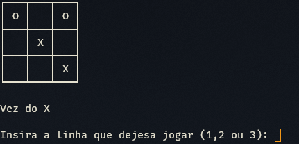

## Jogo da Velha

  
  



  

## Sobre o Projeto

  

Este projeto consiste em um **Jogo da Velha**, utilizando a plataforma .NET.


  

## Objetivo

  

O principal objetivo deste projeto foi o **aprendizado da linguagem C#**

  
  
  

## Como Executar o Projeto

  

Siga os passos abaixo para rodar o projeto na sua máquina:

  

### 1. Clone o repositório

  

```bash

git clone "https://github.com/IsaacRogovski/jogo-da-velha.git"

```

  

### 2. Acesse a pasta do projeto

  

```bash

cd jogo-da-velha

```

  

### 3. Execute o projeto

  

```bash

dotnet run

```

  
  
  

## Tecnologias

  

- C#

- .NET

  
  
  

## Autor

  

Isaac Rogovski

[GitHub](https://github.com/IsaacRogovski)